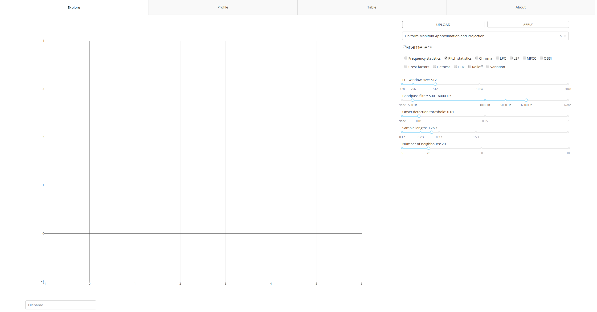
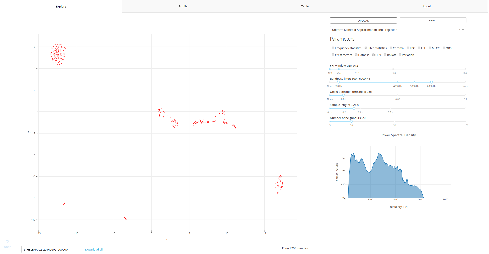

# Getting started

With the Audio Explorer you will be able to easily explore and label sounds present in your recordings. In this section we are going to walk through all options of the app, explain what they do and how they can help you in achieving the task.

## Explore

When you start the app, you arrive in **Explore** section. That's where you can upload the audio, tune various parameters, clean audio and plot the results. The latter will consist of 2-d embedding and spectrogram. Spectrogram is a plot of frequency and its amplitude against time. 

Embedding is the main functionality of the app that sets it apart from most of such software in the market. It allows us to create a 2d scatter plot of sounds by computing various sound features (typically 6 to over 100) and then reducing the dimensionality to 2d. It's done in such a way that most of the information from the high-dimensional space is retained. If we get it right, similar sounds will be close together while different further apart.  

### Preparation

To upload a recording, use *Upload* button. Currently only a single recording can be uploaded at a time, but it's possible to extend the functionality (please drop me a feature request via GitHub). Before you hit the button, consider checking and adjusting settings. 

The settings are applied every time you hit *Upload* or *Apply* button. The difference is that while *Upload* lets you select a file from your file system, *Apply* works on currently uploaded file.

   

#### Settings

Your settings will vary between applications and use cases, there's no one that would fit all problems, which is why Audio Explorer gives user freedom in selecting the right one. It's a good idea to start with default ones.

##### Embedding type and features

The available algorithms and features are discussed in [Audio Embedding](audio_embedding.md) section. [Uniform Manifold Approximation and Projection](https://arxiv.org/pdf/1802.03426.pdf) comes highly recommended.

Selection of features is case-dependent. It's a good idea to start with `pitch`, which calculates mean, median, first and third quantile, interquantile, min and max for each audio fragment (pitch is calculated per window equal to number of samples set in *FFT* setting). It uses excellent algorithm `Yinfft` developed by Paul Brossier (more [here](https://aubio.org/manpages/latest/aubiopitch.1.html)).

##### FFT

FFT stand for Fast Fourier Transform, in this case window size (in number of samples) to be used by the algorithm.

##### Bandpass filter

Bandpass filter allows user to reduce frequencies below / above certain threshold. The filters roll off is at 6dB per octave (20dB per decade). 

##### Onset detection threshold

This method computes the High Frequency Content (HFC) of the input spectral frame from [aubio](https://aubio.org/manpages/latest/aubioonset.1.html). If disabled (set to `None`), the program will simply chop the recording into pieces of length determined by *Sample length* setting. 

The threshold ranges from `0.005` (very sensitive, picks up almost everything) to `0.1`, where only stronger signals are surfaced from the background.

##### Sample length

Length of the audio fragment to consider. It's currently set to a fixed length, but could be made dynamic if needed (to find onset and offset of the sound).

##### Number of neighbours - Important!

Parameter specific to the Uniform Manifold Approximation and Projection algorithm. In general, the lower the number, more local structures can be resolved, at expense of good global separation. If we take large number of neighbours, different sounds will be far apart, while similar clustered very closely together. 

Mind that number of neighbours for the algorithm to consider should be (much) lower than number of audio fragments that we are analysing. Should it happen that there are very few onsets in the recording (say, 8), the algorithm will fail to produce embedding. Consider lowering the value to minimum in such cases or lowering the onset detection threshold.

#### Supported audio formats

Audio Explorer supports majority of popular audio formats thanks to excellent [SoX](http://sox.sourceforge.net/) software and works with both mono and stereo. Here's a comprehensive list:

`8svx aif aifc aiff aiffc al amb amr-nb amr-wb anb au avr awb caf cdda cdr cvs cvsd cvu dat dvms f32 f4 f64 f8 fap flac fssd gsm gsrt hcom htk ima ircam la lpc lpc10 lu mat mat4 mat5 maud mp2 mp3 nist ogg paf prc pvf raw s1 s16 s2 s24 s3 s32 s4 s8 sb sd2 sds sf sl sln smp snd sndfile sndr sndt sou sox sph sw txw u1 u16 u2 u24 u3 u32 u4 u8 ub ul uw vms voc vorbis vox w64 wav wavpcm wv wve xa xi`

Uploaded recording will be normalised and converted to single-channel 16 khz WAV. 

### Upload 

Once you hit *Upload*, your recording will be uploaded, chopped into fragments and audio features calculated per fragment. In the last step an embedding will be produced like this one:

#### What am I looking at?
The scatter plot is the result of running the dimensionality reduction algorithms on audio recordings resulting in a 2D visualization of the dataset. Each data point is a short sample retrieved from audio. You can click on each point and **play** an audio associated with the given point. In the left bottom corner you will find a name of your file and option to download (selected) features associated with your audio.

#### Spectral plot

Once file is uploaded, spectrum of the audio will be plotted in lower right corner. 

Spectrum             |  Spectrogram
:-------------------------:|:-------------------------:
  |  

* Select number of points and spectrum will be plotted only for the given points.
* Click on a single point and a spectrogram will be plotted. A spectrogram is a visual representation of the spectrum of frequencies of a signal as it varies with time. 
 
 Spectrogram allows for further verification of similarity between samples as well as provide insights into frequency structure of the signal. Plotted spectrogram has an extra margin of 0.05 second from both ends to enable better inspection. The extra margin is not considered during the analysis and is visible as a thin black line.

##### Tip

If your display resolution is fairly small, I'd recommend to zoom out the browser for better experience.

#### Selection

Once you hover your mouse pointer over the graph, an extra set of icons will appear in upper right corner of the graph. They allow you to better navigate the graph, zoom in and, most interestingly, select points with *Lasso tool*. 

Why would you want to select specific points:

* Label signal of interest (*Download* button next to the file name)
* Remove selected frequencies (*Remove selected frequencies* button below the *Spectral plot*)
* Inspect when in time these appear (available via **Profile** tab)
* Inspect the features (available via **Table** tab)

#### Download

The *Download* button allows to download features from the selected audio fragments to your local file system. Edit box to the left from the download link allows to change the file name.

#### Play audio

You can play audio fragment by clicking on a point on the main scatter plot. Mind that what you hear and see is longer than selected `Sample length` by 0.05s. from both ends. Margin is added to the beginning and end to get better impression of the sound surrounding the fragment.  

### Didn't get what you expected? 

Adjust the settings and hit *Apply*. 

## Profile

That's where you can see a spectrogram of the complete audio. If you mark any points on the main graph, these will be highlighted on the spectrogram in light red. You can zoom in the graph by holding left mouse button and dragging selection over area of interest.

## Table

In this section you can inspect all features as a table. Features can be sorted and filtered. You can use the following expressions: `<=`, `<`, `>=` and `>`, e.g. `> 2000`.

## Worflow example

1. Tune the algorithm parameters or accept the defaults. 
2. Upload an audio file you want to analyse. If you don't have anything at hand, [here](https://s3.eu-central-1.amazonaws.com/audioexplorer-public/sthelena_example.mp3) is an audio that contains some bird calls, primarily storm petrels, recorded on St. Helena. Can you spot bird calls on the scatter plot? To download the recording, right-click on the link and select "save link as..." and then *Upload* it.
3. Play with the parameters, add / remove features and see how it influences the plot by clicking *Apply*.
4. Click a point on the graph to hear the audio and see the spectrogram. 
5. Calculated audio features can be inspected, sorted and filtered through custom-made query language by selecting _Table_ tab. The selection will be reflected in *Table*.
6. Use *Lasso select* (top right menu that appears after hovering over the graph) to select interesting cluster. 
7. For the selected audio fragments a power spectrum will be plotted (units: Voltage2), scaled to dB.
8. Now that we have frequencies present in the selected fragments, user can decide to reduce presence of these frequencies in rest of the audio.  
9. Once you're happy with the selection, you can download the data from *Table*.

Proper analysis is described in the [Use cases](case_storm_petrels.md) section.