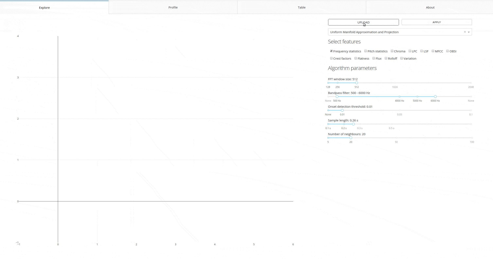

# Welcome to Audio Explorer docs site!

[Audio Explorer](http://audioexplorer.online) helps in audio data discovery and labelling by utilising unsupervised and supervised machine learning - and good deal of statistics with digital signal processing.

